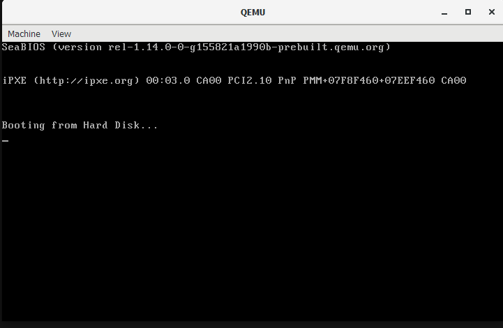

# Initial
Since this is the initial, I would keep it short, checking if all basic component works fine

I started off with writing basic boot in assembly. Afterwards, compiling the assembly file then tested it out with qemu-system-x86_x64
> Steps (in ./src)

Code
```asm
jmp $

times 510 - ($ - $$) db 0
db 0x55, 0xaa
```

Compilation

```sh
nasm -f bin boot.asm -o boot.bin
```

Boot up
```sh
qemu-system-x86_64 boot.bin
```

Successful boot up


Great! It did not take much time creating this commit. However, the rest of the project would have slower commits. Hope to finish up the next commit soon!

# Reference(s)
1) [Intro to OS](https://www.youtube.com/watch?v=MwPjvJ9ulSc)