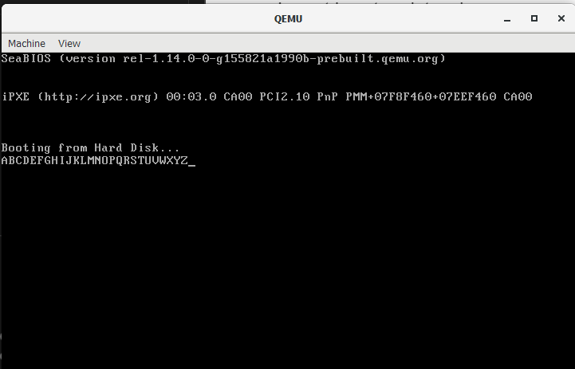

# Overview
- Learnt how to print a char
- Basic Loop and If conditions

I learnt how to use jmp to enter function "blocks". After following tutorials on youtube, I was able to print out 'A' to 'Z'!

> Code
```asm
mov ax, 0x44
mov al, 65
jmp loop
loop:
    mov ah, 0x0e
    int 0x10
    inc al
    cmp al, 91
    jne loop

jmp $

times 510 - ($ - $$) db 0
db 0x55, 0xaa
```

Output:


# References
1. [BIOS, Printing the Alphabet, Conditional Jumps](https://www.youtube.com/watch?v=APiHPkPmwwU)
