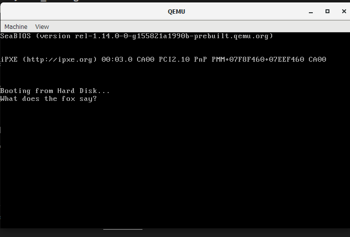

# Overview
- 

After familiarising myself with conditions, loops and how to utilize the AH register to print characters.

I found out how to include files. Which is
> %include "file.asm"
- Calling any imported function would be as simple as 
    > call imported_function

Here is a basic implementation of that

Code:
> Boot.asm
```asm
[org 0x7c00]
    mov bx, the_string
    call the_imported_print

    jmp $

%include "print.asm" 
; Data
the_string:
    db 'What does the fox say?', 0

times 510 - ($ - $$) db 0
db 0x55, 0xaa
```
>print.asm
```asm
the_imported_print:
    cmp byte [bx], 0
    je return
    mov ah, 0x0e
    mov al, byte [bx]
    int 0x10
    inc bx
    jmp the_imported_print
return:
    ret
```

This took sooo long, Turns out it was due to how i structured my code in ```boot.asm```, the org was not wrapped arnd the calling and ```mov bx, the_string``` line.

Now on to the fun stuff. Im skipping a few sub chapters [Major regret] in the document(1). Based off my previous knowledge on assembly language, I decided to stop at the ```Extended Memory Access Using Segments``` chapter. To prevent any memory complications in the future, we would be implementing things covered in this chapter first.

Turns out this chapter was just a reimplementation of how the data segment of the code is accessed by utilizing the **ds** register so the edit of the code in ```boot.asm``` now looks like this
>Edited boot.asm
```asm
mov cx, 0x7c0
mov ds, cx
mov bx, the_string
call the_imported_print

jmp $

%include "print.asm" 
; Data
the_string:
    db 'What does the fox say?', 0

times 510 - ($ - $$) db 0
db 0x55, 0xaa
```


From now I would be refering to the OS "Handbook" for now to ensure I am following the "most optimal path". Also, this commit is going to be really long as well.
# References
1) [OS "Handbook"](https://www.cs.bham.ac.uk/~exr/lectures/opsys/10_11/lectures/os-dev.pdf)

