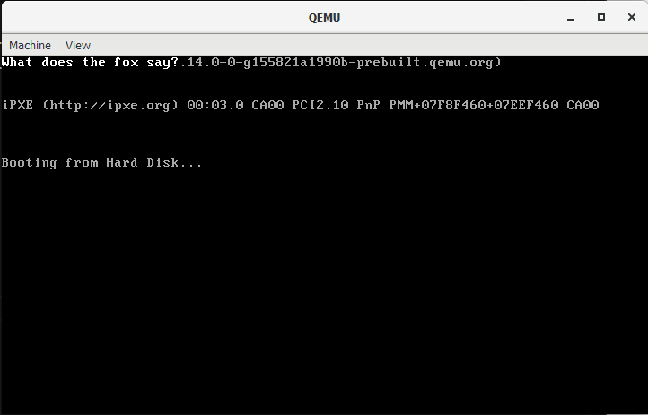

# Overview
-  Enter 32-Bit
-  Printing White

In order to "create" sound and video, we are required to enter 32-bit protected mode to create drivers for our operating system. From what I saw in the document(1), we would be abandoning the BIOS which means that there would be better performance for rendering the video! (I think)

For now let's just focus on 32-Bit.

In order to do that,  I have moved or copied all files related to the BIOS (basically where interrupt is used into legacy folder). So now the file tree looks something like this (not including .bin)
```
journal
media
src/
    legacy/
        print.asm
    BadApple.mp4(downloaded from the internet)
    boot.asm
```

I cleared up the 16-bit stuff that I have touched on. Proceeded to start working on the 32-bit stuff :D

I would start off by "following" the document(1), 
there were alot of syntax that I did not really know about:
1) pusha -> Pushs all general purpose register(for ex. [a-d]x) 
2) equ -> gives a symbolic name to a numeric constant (basically instantiate for integers)
3) popa -> Pops all general purpose registers

I "coded" the display for printing things in 32-bit mode. At the time of reading this, I am  still not sure whether if the code works 
(P.S it worked, but ```jmp string_pm_loop```, I dont know why).
```asm
; The routine for printing in 32-bit
[bits 32]
VIDEO_MEMORY equ 0xb8000 ; Start of Screen
WHITE_ON_BLACK equ 0x0f ; Color White

; before loop
print_string_pm:
    pusha
    mov edx, VIDEO_MEMORY
    jmp print_string_pm_loop

; Writing values to the video memory
print_string_pm_loop:
    mov al, [ebx] ; ebx is the string offset
    mov ah, WHITE_ON_BLACK ; Setting white on "writer"
    ;visually what is pushed into edx is 0x[ah][al]
    cmp al, 0
    je print_string_pm_done

    mov [edx], ax ; writer
    
    inc ebx ;  increase string offset
    add edx, 2 ; Moving over to next character cell for printing

    jmp print_string_pm_loop

print_string_pm_done:
    popa
    ret
```
I actually found another reference(2) for me to learn OS dev from, but I decided to stick with this(1) for now

Second part of trying to turn from 16-bit to 32-bit,
- Working on GDT

(Side Note) Just noticed that 32-bit is for the execution of higher level of code(like C or Java)


```asm
; GDT
gdt_start:

gdt_null: ; Mandantory Null Descriptor
    dd 0x0
    dd 0x0

gdt_code:
    dw 0xffff ; Limit
    dw 0x0 ; base
    db 0x0 ; base
    db 10011010b ; 1st Flag(Present, privilege, DT), Type Flag(Code, Conforming, readable, accessed)
    ab 11001111b ; 2nd Flag(Granularity, 32-bit default, 64-bit code segment, AVL), Limit
    db 0x0

gdt_data:
    dw 0x0ffff ;Limit
    dw 0x0 ; Base 
    db 0x0 ; Base
    db 10010010b ; Only difference is code flag since its data segment
    db 11001111b
    db 0x0

gdt_end: ; Putting gdt_start and gdt_end for gdt size calculation

gdt_descriptor: ;(gdt_size, gdt_address)
    dw gdt_end - gdt_start - 1
    dd gdt_start


CODE_SEG equ gdt_code - gdt_start
DATA_SEG equ gdt_data - gdt_start
```

I basically copied the code, but it actually helped me understand what the segment descriptor structure is like.

Now the final part,
- Clearing Interrupts
- And telling the CPU to use our defined gdt descriptor
- Setting cr0(first bit of a special CPU control register)
- Pipelineing (this sounds really really hard)

Clear interrupts with ```cli```

Use defined gdt Descriptor with ```lgdt [gdt_descriptor]```

Set cr0 with
```asm
mov eax, cr0 ; Turning switch into protected mode
or eax, 0x1 ; Using or method to update control bit to 32-bit mode
mov cr0, eax
```

And now pipelining, first of all, I have never even heard of it, it just sounds fast.

From the document, due to some issues with **jmp** and **call**, we are issuing a far jump 
```
jmp CODE_SEG:init_pm
```
In the init_pm (pm is protected_mode), we reload all the segment registers and update stack pointers call the main function
```asm
    ;Reload segment registers
    mov ax, DATA_SEG
    mov ds, ax
    mov ss, ax
    mov es, ax
    mov fs, ax
    mov gs, ax

    ;Update stack pointer
    mov ebp, 0x90000 
    mov esp, ebp
```
Running the whole code together, after fixing some syntax errors. The code prints out the string!


I will end this commit here, next I would be working on building the kernel I think? Prehaps I would update the specifics as well : )


# References
1) [OS Handbook](https://www.cs.bham.ac.uk/~exr/lectures/opsys/10_11/lectures/os-dev.pdf)
2) [OS Dev Wiki](https://wiki.osdev.org/)


